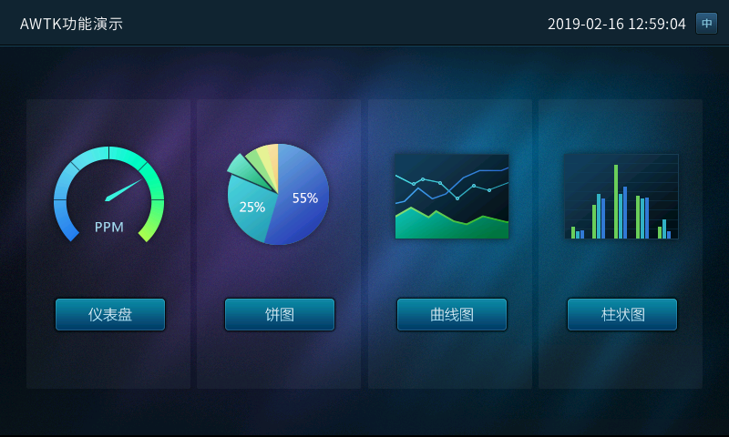
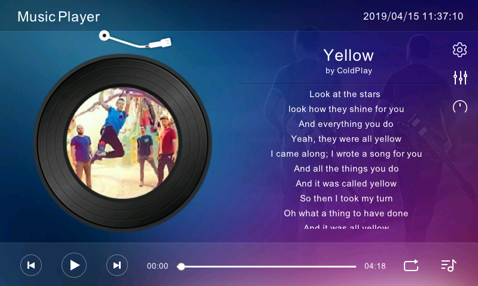

## ZLG AWTK 1.3 Release Notes

## 一、介绍

[AWTK](https://github.com/zlgopen/awtk) 全称 Toolkit AnyWhere，是 [ZLG](http://www.zlg.cn/) 开发的开源 GUI 引擎，旨在为嵌入式系统、WEB、各种小程序、手机和 PC 打造的通用 GUI 引擎，为用户提供一个功能强大、高效可靠、简单易用、可轻松做出炫酷效果的 GUI 引擎。

#### [AWTK](https://github.com/zlgopen/awtk) 寓意有两个方面：

* Toolkit AnyWhere。 
* ZLG 物联网操作系统 AWorksOS 内置 GUI。

#### [AWTK](https://github.com/zlgopen/awtk) 源码仓库：

* 主源码仓库：[https://github.com/zlgopen/awtk](https://github.com/zlgopen/awtk)
* 镜像源码仓库：[https://gitee.com/zlgopen/awtk](https://gitee.com/zlgopen/awtk)

#### 运行效果截图：

## 二、最终目标：

* 支持开发嵌入式应用程序。
* 支持开发 Linux 应用程序。
* 支持开发 MacOS 应用程序。
* 支持开发 Windows 应用程序。
* 支持开发 Web APP。
* 支持开发 Android 应用程序。
* 支持开发 iOS 应用程序。
* 支持开发微信小程序。
* 支持开发支付宝小程序。
* 支持开发百度小程序。
* 支持开发 2D 小游戏。

## 三、主要特色

### 1. 跨平台

[AWTK](https://github.com/zlgopen/awtk) 是跨平台的，这有两个方面的意思：

* AWTK 本身是跨平台的。目前支持的平台有 ZLG AWorksOS、Windows、Linux、MacOS、嵌入式 Linux、Android、Web 和嵌入式裸系统，可以轻松的移植到各种 RTOS 上。AWTK 以后也可以运行在各种小程序和 iOS 等平台上运行。

* AWTK 同时还提供了一套跨平台的基础工具库。其中包括链表、数组、字符串 (UTF8 和 widechar)，事件发射器、值、对象、文件系统、互斥锁和线程、表达式和字符串解析等等，让你用 AWTK 开发的应用程序可以真正跨平台运行。

### 2. 高效

[AWTK](https://github.com/zlgopen/awtk) 通过一系列的手段保证 AWTK 应用程序高效运行：

* 通过脏矩算法只更新变化的部分。
* 支持 3 FrameBuffer 让界面以最高帧率运行 （可选）。
* UI 描述文件和主题文件使用高效的二进制格式，解析在瞬间完成。
* 支持各种 GPU 加速接口。如 OpenGL、DirectX、Vulkan 和 Metal 等。
* 支持嵌入式平台的各种 2D 加速接口。目前 STM32 的 DMA2D 和 NXP 的 PXP 接口，厂家可以轻松扩展自己的加速接口。

### 3. 稳定

[AWTK](https://github.com/zlgopen/awtk) 通过下列方式极力让代码稳定可靠：

* 使用 cppcheck 和 facebook infer 进行静态检查。
* 使用 valgrind 进行动态内存检查。
* 近两万行的单元测试代码。
* ZLG 强大 GUI 团队的支持。
* 经过多个实际项目验证。
* 多平台 / 多编译器验证。
* 优秀的架构设计。
* Code Review。
* 手工测试。

### 4. 强大

* 丰富的控件 （持续增加中）。
* 支持各种图片格式 (png/jpg/gif/svg)。
* 支持各种字体格式 （点阵和矢量）。
* 支持窗口动画
* 支持控件动画
* 支持高清屏。
* 支持界面描述文件。
* 支持主题描述文件。
* 支持控件布局策略。
* 支持对话框高亮策略。
* 丰富的辅助工具。
* 支持从低端的 Cortex M3 到各种高端 CPU。
* 支持无文件系统和自定义的文件系统。
* 支持裸系统和 RTOS。

### 5. 易用

* 大量的示例代码。
* 完善的 API 文档和使用文档。
* ZLG 强大的技术支持团队。
* 用 AWTK 本身开发的界面编辑器 （开发中）。
* 声明式的界面描述语言。一行代码启用控件动画，启用窗口动画，显示图片 (png/jpg/svg/gif)。

### 6. 高度扩展性

* 可以扩展自己的控件。
* 可以扩展自己的动画。
* 可以实现自己的主循环。
* 可以扩展自己的软键盘。
* 可以扩展自己的图片加载器。
* 可以扩展自己的字体加载器。
* 可以扩展自己的输入法引擎。
* 可以扩展自己的控件布局算法。
* 可以扩展自己的对话框高亮策略。
* 可以实现自己的 LCD 接口。
* 可以扩展自己的矢量引擎 （如使用 skia/cairo)。
* 所有扩展组件和内置组件具有相同的待遇。

### 7. 多种开发语言

[AWTK](https://github.com/zlgopen/awtk) 本身是用 C 语言开发的，可以通过 IDL 生成各种脚本语言的绑定。生成的绑定代码不是简单的把 C 语言的 API 映射到脚本语言，而是生成脚本语言原生代码风格的 API。目前支持以下语言 （以后根据需要增加）：

* C
* Lua
* Javascript on jerryscript
* Javascript on nodejs
* Javascript on quickjs

### 8. 国际化

* 支持 Unicode。
* 支持输入法。
* 支持字符串翻译 （实时生效）。
* 支持图片翻译 （实时生效）。
* 文字双向排版 （计划中）。

### 9. 开放源码，免费商用 (LGPL)

## 四、1.3 版本更新
-------------------

### 1. 细节完善
  * 完善输入法和软键盘。
  * 完善控件焦点的处理。
  * 完善 freetype 的支持。
  * 用户自定义的资源的目录。
  * popup 支持 highlight效果。
  * 支持 8bit gray+alpha png。
  * 修改 Linux CPU 占用高的问题
  * time clock 支持指针支持锚点。
  * progress bar 支持 max 属性。
  * 时间修改为 64 位，防止时间溢出。
  * 完善 edit/mledit获得焦点时选中文本。
  * glyph 的 x/y/w/h 改为 16 位，以防超大字体溢出问题。

### 3. 新增特性
  * 支持单色屏。
  * 支持主题切换实时生效。
  * OpenGL 模式下支持脏矩形。
  * OpenGL 模式下支持屏幕旋转。
  * 增加UI反馈接口(方便实现按键音和震动效果)。
  * 引入片段帧缓存 (Fragment Frame Buffer)，有效解决无framebuffer时闪烁的问题。

### 4. 新增控件
  * draggable 
  * combo\_box\_ex

### 5. 新增重要 API
  * 增加 semaphore
  * 增加 object\_array
  * 增加 event\_source
  * 增加 ring\_buffer
  * 增加 graphic\_buffer
  * 增加 stream 接口以及各种实现。
  * 增加 ubjson 实现，为嵌入式系统提供高效、紧凑和标准的格式，可以用于存储和通信。

### 6. 新增平台
  * [android](https://github.com/zlgopen/awtk-android)
  * [tencentos](https://github.com/zlgopen/awtk-stm32f103ze-tencentos)
  * [rt-thread](https://github.com/zlgopen/awtk-stm32f103ze-rtthread)
  * [esp32(第三方开发者提供)](https://github.com/jason-mao/esp32-awtk)
  * [freertos(第三方开发者提供)](https://github.com/wpmyj/awtk-stm32f769-freertos)

### 7. 新增语言绑定
  * [QuickJS](https://github.com/zlgopen/awtk-quickjs)

### 8. 新增原厂支持
  * [君正](http://www.ingenic.com.cn/)

### 9.Bug 修改和完善功能

详情请参考 [docs/changes.md](https://github.com/zlgopen/awtk/blob/master/docs/changes.md)。

> 欢迎广大开发者一起参与开发：[生态共建计划](../awtk_ecology.md)。

[谢谢大家支持，请投AWTK一票](https://www.oschina.net/project/top_cn_2019)

