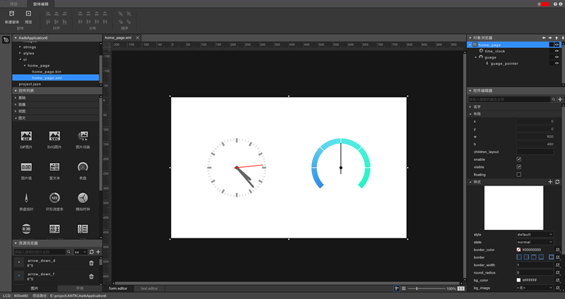
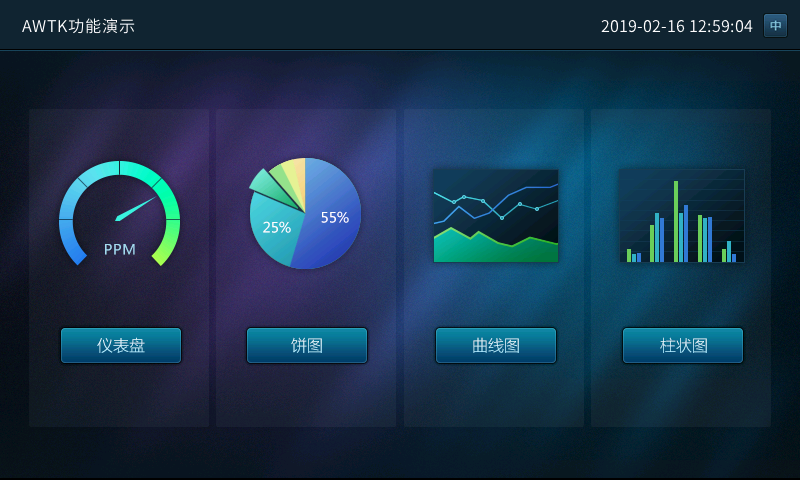
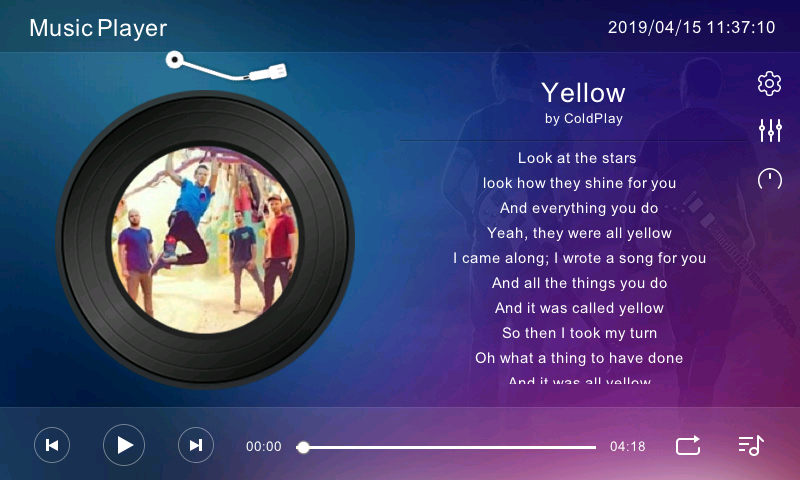
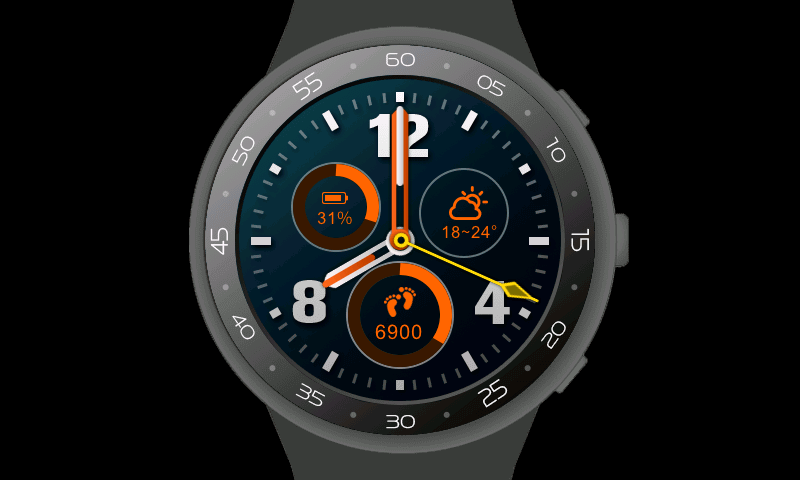

## ZLG AWTK 2.0 Release Notes

## 一、介绍

[AWTK](README.md) 全称 Toolkit AnyWhere，是 [ZLG](http://www.zlg.cn/) 开发的开源 GUI 引擎，旨在为嵌入式系统、WEB、各种小程序、手机和 PC 打造的通用 GUI 引擎，为用户提供一个功能强大、高效可靠、简单易用、可轻松做出炫酷效果的 GUI 引擎。

> 欢迎广大开发者一起参与开发：[生态共建计划](docs/awtk_ecology.md)。

#### [AWTK](README.md) 寓意有两个方面：

* Toolkit AnyWhere。 
* ZLG 物联网操作系统 AWorksOS 内置 GUI。

#### [AWTK](README.md) 源码仓库：

* 主源码仓库：[https://github.com/zlgopen/awtk](https://github.com/zlgopen/awtk)
* 镜像源码仓库：[https://gitee.com/zlgopen/awtk](https://gitee.com/zlgopen/awtk)

#### AWTK Designer 界面设计工具：

* 不再需要手写 XML
* 拖拽方式设计界面，所见即所得
* 快速预览，一键打包资源
* 注册及下载地址：https://awtk.zlg.cn

#### 运行效果截图：

## 二、最终目标：

* 支持开发嵌入式应用程序。✔
* 支持开发 Linux 应用程序。✔
* 支持开发 MacOS 应用程序。✔
* 支持开发 Windows 应用程序。✔
* 支持开发 [Web](https://github.com/zlgopen/awtk-web.git) 应用程序。✔
* 支持开发 [Android](https://github.com/zlgopen/awtk-android.git) 应用程序。✔
* 支持开发 [iOS](https://github.com/zlgopen/awtk-ios.git) 应用程序。✔
* 支持开发 [鸿蒙系统](https://github.com/zlgopen/awtk-harmonyos-next.git) 应用程序。✔
* 支持开发 2D 小游戏。

## 三、主要特色

### 1. 跨平台

[AWTK](README.md) 是跨平台的，这有两个方面的意思：

* AWTK 本身是跨平台的。目前支持的平台有 ZLG AWorksOS、Windows、Linux、MacOS、嵌入式 Linux、Android、iOS、鸿蒙系统、Web 和嵌入式裸系统，可以轻松的移植到各种 RTOS 上。AWTK 以后也可以运行在各种小程序平台上运行。

* AWTK 同时还提供了一套跨平台的基础工具库。其中包括链表、数组、字符串 (UTF8 和 widechar)，事件发射器、值、对象、文件系统、互斥锁和线程、表达式和字符串解析等等，让你用 AWTK 开发的应用程序可以真正跨平台运行。

### 2. 高效

[AWTK](README.md) 通过一系列的手段保证 AWTK 应用程序高效运行：

* 通过脏矩算法只更新变化的部分。
* 支持 3 FrameBuffer 让界面以最高帧率运行 （可选）。
* UI 描述文件和窗体样式文件使用高效的二进制格式，解析在瞬间完成。
* 支持各种 GPU 加速接口。如 OpenGL、DirectX、Vulkan 和 Metal 等。
* 支持嵌入式平台的各种 2D 加速接口。目前 STM32 的 DMA2D 和 NXP 的 PXP 接口，厂家可以轻松扩展自己的加速接口。

### 3. 稳定

[AWTK](README.md) 通过下列方式极力让代码稳定可靠：

* 使用 cppcheck 和 facebook infer 进行静态检查。
* 使用 valgrind 进行动态内存检查。
* 近两万行的单元测试代码。
* ZLG 强大 GUI 团队的支持。
* 经过多个实际项目验证。
* 多平台 / 多编译器验证。
* 优秀的架构设计。
* Code Review。
* 手工测试。

### 4. 强大

* 丰富的控件 （持续增加中）。
* 支持各种图片格式 (png/jpg/gif/svg)。
* 支持各种字体格式 （点阵和矢量）。
* 支持窗口动画。
* 支持控件动画。
* 支持高清屏。
* 支持界面描述文件。
* 支持窗体样式描述文件。
* 主题切换实时生效。
* 支持控件布局策略。
* 支持对话框高亮策略。
* 丰富的辅助工具。
* 支持从低端的 Cortex M3 到各种高端 CPU。
* 支持无文件系统和自定义的文件系统。
* 支持裸系统和 RTOS。
* 支持事件录制与重放进行压力测试。
* 支持 Appium 进行全自动化 UI 测试。

### 5. 易用

* 大量的示例代码。
* 完善的 API 文档和使用文档。
* ZLG 强大的技术支持团队。
* 用 AWTK 本身开发的 [界面编辑器](https://awtk.zlg.cn)。
* 声明式的界面描述语言。一行代码启用控件动画，启用窗口动画，显示图片 (png/jpg/svg/gif)。

### 6. 高度扩展性

* 可以扩展自己的控件。
* 可以扩展自己的动画。
* 可以实现自己的主循环。
* 可以扩展自己的软键盘。
* 可以扩展自己的图片加载器。
* 可以扩展自己的字体加载器。
* 可以扩展自己的输入法引擎。
* 可以扩展自己的控件布局算法。
* 可以扩展自己的对话框高亮策略。
* 可以实现自己的 LCD 接口。
* 可以扩展自己的矢量引擎 （如使用 skia/cairo）。
* 所有扩展组件和内置组件具有相同的待遇。

### 7. 多种开发语言

[AWTK](README.md) 本身是用 C 语言开发的，可以通过 IDL 生成各种脚本语言的绑定。生成的绑定代码不是简单的把 C 语言的 API 映射到脚本语言，而是生成脚本语言原生代码风格的 API。目前支持以下语言 （以后根据需要增加）：

* C
* Go
* C++
* lua
* java
* python
* Javascript on jerryscript
* Javascript on nodejs
* Javascript on quickjs

### 8. 国际化

* 支持 Unicode。
* 支持输入法。
* 支持字符串翻译 （实时生效）。
* 支持图片翻译 （实时生效）。
* 文字双向排版。

### 9. 为嵌入式软件定制的 MVVM 框架，彻底分离用户界面和业务逻辑。
* 性能高。
* 内存开销小。
* 隔离更彻底。
* 可移植到其它 GUI。
* 代码小（~5000 行）。
* 无需学习 AWTK 控件本身的 API。
* 支持多种编程语言（目前支持 C/JS）。

> 详情请参考：https://github.com/zlgopen/awtk-mvvm

### 10. 开放源码，免费商用 (Apache License 2.0)。

> 欢迎对照 [《GUI 引擎评价指标》](https://github.com/zlgopen/gui-lib-evaluation) 进行评测。

## 四、2.0 版本更新
-------------------

相对 1.8（2024/08/21）至 2026/09/26。修 bug、注释和小优化见 [最新动态](https://github.com/zlgopen/awtk/blob/master/docs/changes.md)。

### 1. 细节完善

> 大量细节完善请参考 [最新动态](https://github.com/zlgopen/awtk/blob/master/docs/changes.md)

### 2. 新增文档

* [HarfBuzz 与 FriBidi/SheenBidi](../howtos/how_to_use_fribidi_sheenbidi_with_harfbuzz.md)
* [如何使用多点触摸事件](../howtos/how_to_use_multi_touch_event.md)
* [如何使用 OpenGL 绘制图形](../howtos/how_to_draw_with_opengl.md)
* [如何让 JSON 文件和 object 相互转换](../howtos/how_to_convert_between_json_file_and_object.md)
* [如何设置窗体的回车与 ESC](../howtos/how_to_set_form_enter_and_esc.md)
* [如何设置软键盘候选词可见个数](../howtos/how_to_set_keyboard_visible_num.md)
* [如何使用 Wayland 作为 SDL 视频驱动](../howtos/how_to_use_wayland_as_sdl_video_driver.md)
* [弹性自布局](../self_layouter_flex.md)（`self_layouter_flex`）

### 3. 新增重要特性

* 许可证由 LGPL 变更为 Apache License 2.0（不兼容）。
* 移除 BGFX 后端（不兼容：`NANOVG_BACKEND=BGFX` 及 `3rd/bgfx` 已删除）。
* 移除 AGG 后端残留（不兼容：`NANOVG_BACKEND=AGG` 已清理，软件渲染仅保留 AGGE）。
* 废弃 `default_focused_child` 属性（已废弃）。
* 新增 HarfBuzz 文本整形，配合 FriBidi/SheenBidi 支持阿拉伯语、印度语、希伯来语和泰语等复杂文本。增加 `BIDI_BACKEND`、`TEXT_SHAPING` 编译选项，双向算法默认使用 SheenBidi。
* 支持 CMake 编译，并可通过 `AWTK_SDL_VERSION` 选择 SDL2（默认，使用内置 SDL）或 SDL3（使用系统 SDL3）。
* 时间类型改为 64 位。
* Cairo 后端的 vgcanvas 支持绘制文本，复用 `font_manager` 字形管线（含字体回退与点阵字形）。
* `vgcanvas_create_fbo_ex`：GPU FBO 可附带深度缓冲，控件截屏支持 3D 控件。
* 支持 OTF 字体。SVG 支持圆角矩形，矢量填充支持非零规则。
* 新增 `edit_ex`：建议词、回车搜索、奇偶项样式与多行。edit 支持建议输入。
* Combo Box 支持用鼠标滚轮修改选项。`rich_text` 支持 `word_wrap`。`gif_image` 支持边播放边加载。
* 新增 `self_layouter_flex`。children 布局可选择使用虚拟高度或控件高度。
* `conf_io` 支持 YAML（引号字符串、流式集合、多行文本等）。
* `list_view` 支持水平滚动。window 增加 `accept_button` 与 `cancel_button`。
* 支持 Linux G2D。使用 Cairo 时自动启用 pixman G2D。AGGE 增加 RGB565 位图。增加 `lcd_mem_argb8888`。
* OpenGL 可在平台抗锯齿与矢量库抗锯齿之间切换，并支持快速旋转。
* 增加 wchar32、原子操作、树结构，以及 `object_fifo`、`object_workflow_cmd`、`object_evt_router`、`object_override`、`object_load_conf`。
* XML `<?include?>` 可用 `prop_name-prop` 修改被包含控件的属性和样式。预览程序可从 strings.xml 读取翻译。
* 支持 OpenRTOS 头文件。控件弹出 popup 时不丢失焦点。
* 增加 x4 图片打包。字号可转换为标准字号。软键盘候选词可见个数可配置。
* 增加鼠标额外按键事件。fscript 支持获取变量名、`strcasecmp`/`strncasecmp`、`exec`/`exec_ex`、`var_exists`，以及 `%` 开头的变量名。

### 4. 新增重要 API

* `idle_remove_ex`
* `vgcanvas_create_fbo_ex`
* `tk_service_start_ex`
* `fscript_get_vars`
* `fscript_create_ex2`
* `fscript_set_name`
* `str_replace_ex`
* `str_escape`
* `str_dequote`
* `str_remove_str_right`
* `str_append_format_padding`
* `tk_str_ieq_with_len`
* `tk_str_find`
* `tk_str_trim_right`
* `tk_str_trim_left`
* `tk_wstr_ieq`
* `wstr_modify_wchar`
* `tk_count_lines`
* `tk_wstr_count_lines`
* `tk_ret_to_str`
* `tk_days_in_month`
* `tk_ulltoa`
* `tk_isalnum`
* `tk_await`
* `tk_yield_when_timeout`
* `tk_sha256_hash_from_str`
* `tk_strs_bsearch`
* `tk_rad_equal`
* `tk_normalize_rad`
* `tk_run_in_ui_thread_ensure_queue`
* `tk_run_in_ui_thread_ensure_queue_ex`
* `tk_object_ref_by_lifecycle`
* `tk_object_unref_by_lifecycle`
* `tk_object_exec_ex`
* `tk_object_life_t`
* `object_from_json`
* `object_load_conf`
* `object_override_set_base_obj`
* `object_evt_router_publish`
* `clear_props`
* `find_prop`
* `find_props`
* `value_compare`
* `value_replace`
* `file_write_ex`
* `file_write_sync_ex`
* `conf_yaml_load_ex`
* `conf_node_load_json`
* `conf_doc_foreach_ex`
* `conf_doc_foreach_path`
* `rbuffer_read_uint_from_hexstr`
* `wbuffer_clone`
* `wbuffer_modify_binary`
* `darray_reverse`
* `dlist_get`
* `slist_get`
* `raw_darray`
* `fs_foreach_dir`
* `tcp_set_keep_info`
* `edit_get_int64`
* `edit_ex_set_suggest_words_popup_on_updated`
* `widget_animate_position_to`
* `widget_animate_size_to`
* `list_view_get_scroll_bar`
* `path_extname_is_one_of`
* `return_ret_if_fail`
* `self_layouter_flex`
* `mem_allocator_fixed_block`
* `rectf_intersect`
* `tree_to_string`
* `waitable_ring_buffer_is_empty`
* `tk_cond_var_clear`
* `native_window_set_window_hit_test`
* `main_loop_post_touch_event`
* `bitmap_deinit`
* `bitmap_set_dirty`
* `bitmap_is_dirty`
* `atomic_compare_exchange`
* `lcd_mem_argb8888`

### 5. 新增控件

* `edit_ex`：带建议词的编辑框，支持回车搜索、奇偶项样式与多行。
* [3D 场景](https://github.com/zlgopen/awtk-widget-coin3d)
* [3D 图表](https://github.com/zlgopen/awtk-widget-plot3d)

### 6. 新增相关项目

* [awtk-harmonyos-next](https://github.com/zlgopen/awtk-harmonyos-next)。

> 欢迎广大开发者一起参与开发：[生态共建计划](../awtk_ecology.md)。
