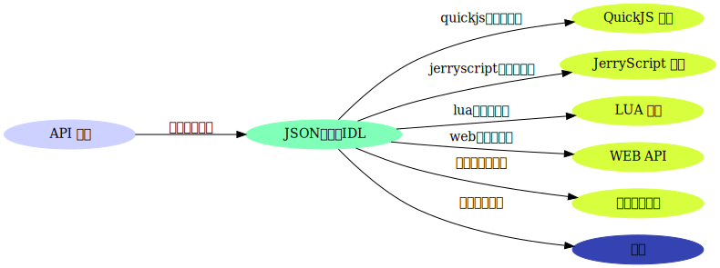

# AWTK 脚本绑定的实现原理 - lua 绑定

脚本化是 [AWTK](https://github.com/zlgopen/awtk) 的一个基本功能。[AWTK](https://github.com/zlgopen/awtk) 计划支持嵌入式系统中常用的脚本，如 lua、python 和 jerryscript。脚本绑定说简单也简单，说复杂也复杂，采用 FFI(calling external C functions) 和 SWIG 绑定一些简单的函数是很方便的，但绑定一个复杂的 GUI 系统还是很有挑战的。之所以不采用通用的工具，而是实现自己的代码产生器，主要有以下考虑：

* 我使用 FFI 和 SWIG 的经验很有限，觉得有些功能不太好实现，至少目前我还不知道实现这些功能的方法和思路。

* 担心 FFI 和 SWIG 的运行环境的可移植性。在 Windows、Linux 和 Macos 上肯定是没有问题的，但是在嵌入式系统，特别是 RTOS 和裸系统中，支持像动态库等功能可能有些困难的。

* 对 jerryscript 没有支持。jerryscript 是三星开源的 javascript 实现，在嵌入式系统中用得比较多，通用的绑定机制对 jerryscript 没有支持。

* 代码风格。不同语言有不同的代码风格，特别是命名风格，直接把 C 言语的风格映射过去，对于开发者不太友好。FFI 和 SWIG 都需要做额外的工作才能实现这个功能。

* AWTK 采用面向对象设计，并用 C 实现面向对象编程的。而通用的绑定机制对此并不友好，实现起来非常困难。
 
* 自定义的代码产生器并不复杂，而且具有更大的灵活性。 

基于以上这些原因，我决定自己实现 [AWTK](https://github.com/zlgopen/awtk) 的脚本绑定机制。它的实现原理如下：用特定格式的 API 注释来描述要脚本化的 API，用一个名为 gen\_idl 的工具把注释提取出来生成 JSON 的接口描述文件，然后用不同的代码产生器生成对应语言的绑定：

 

### 参考

1.[API 注释格式](api_doc.md)

2.[JerryScript 绑定](https://github.com/zlgopen/awtk-jerryscript)

3.[QuickJS 绑定](https://github.com/zlgopen/awtk-quickjs)

4.[Lua 绑定](https://github.com/zlgopen/awtk-lua)
