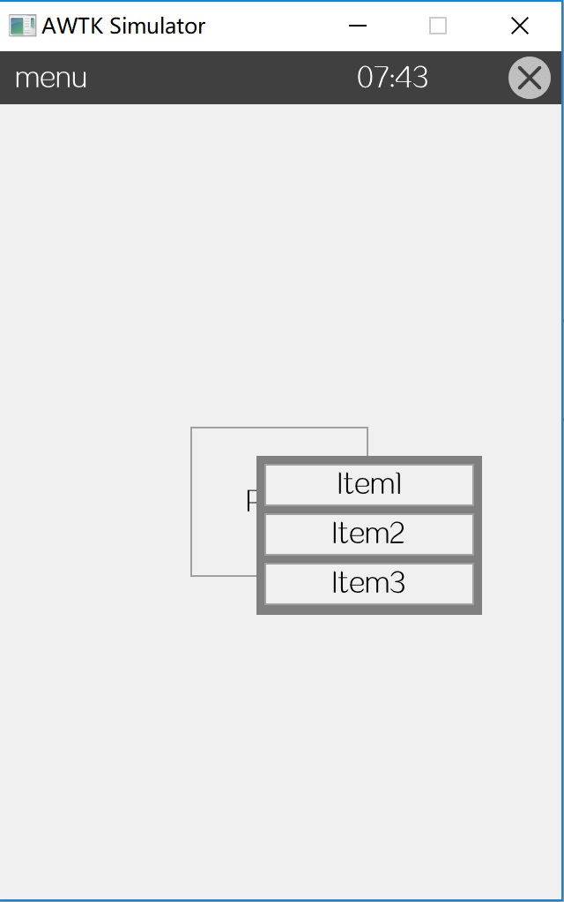
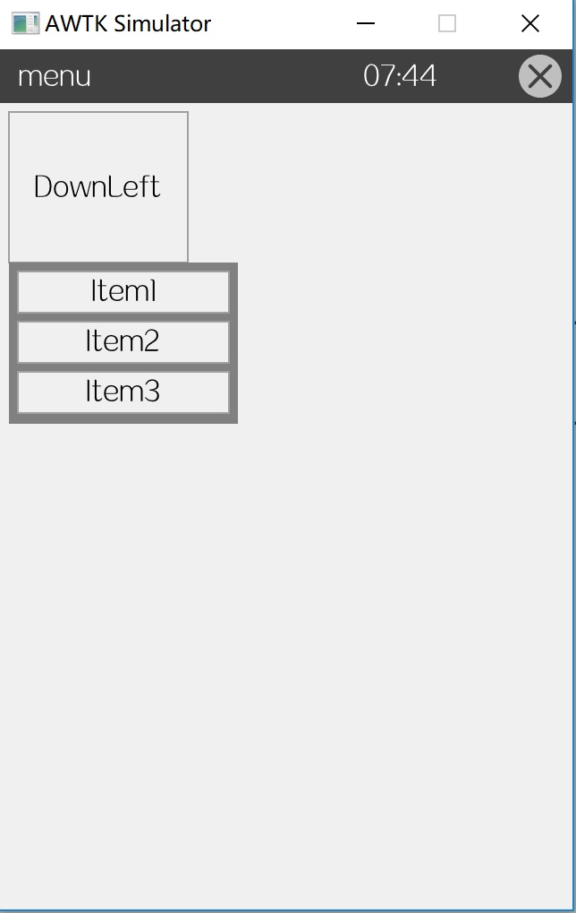
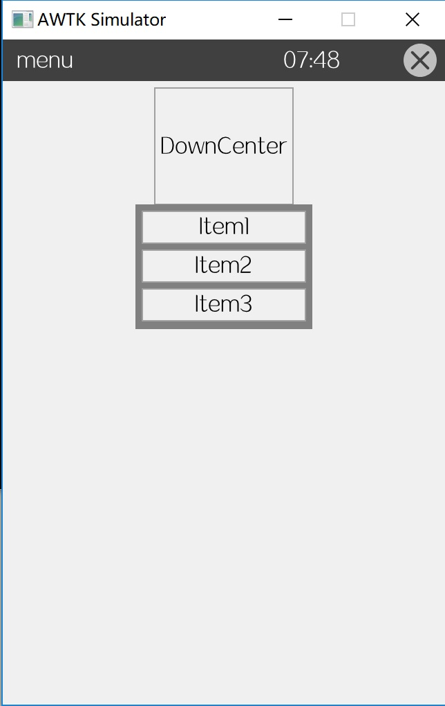
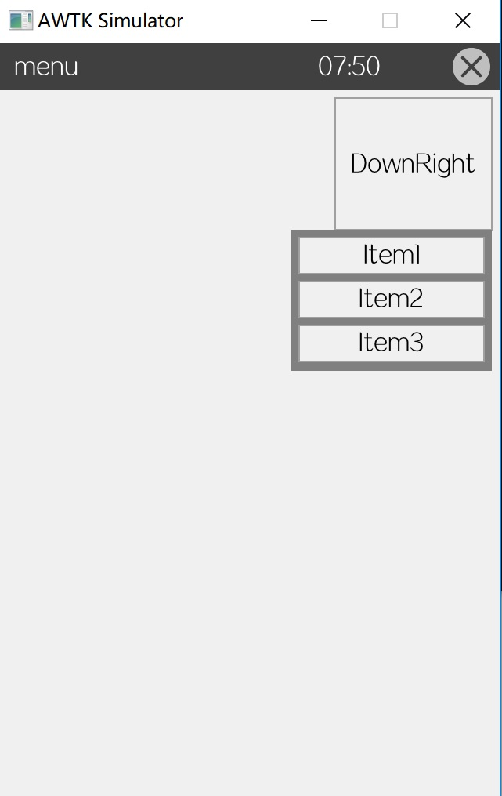
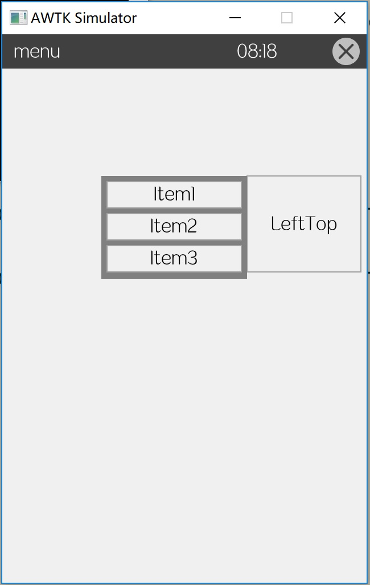
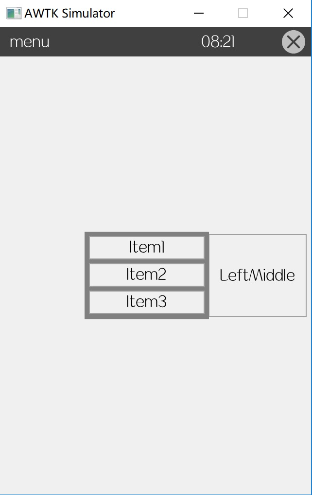
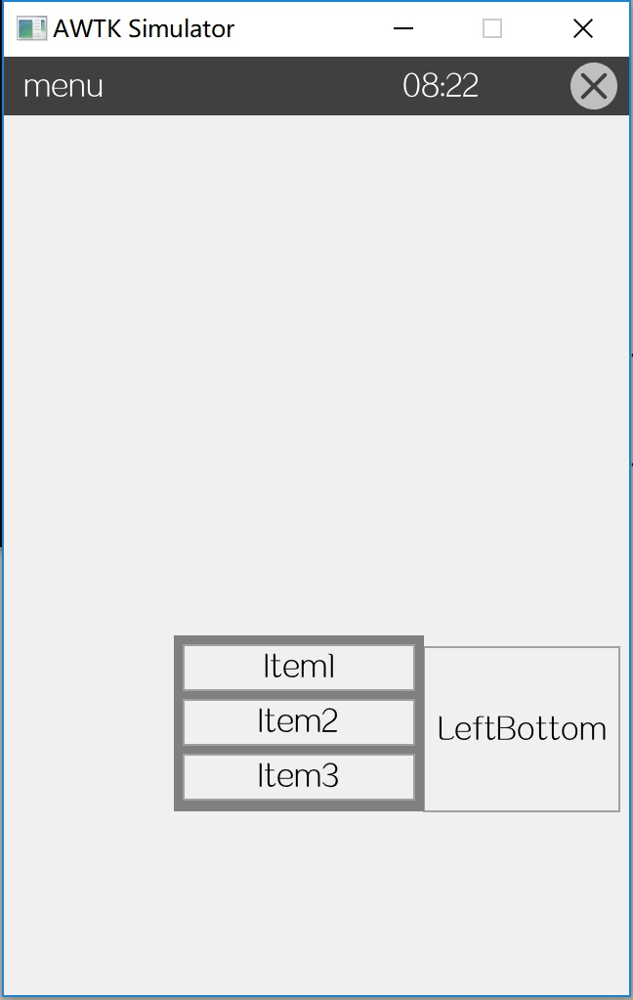

# menu 自身布局器 (self\_layouter\_menu) 介绍


## 1. 概述

用于确定菜单的位置和大小，菜单一般用 popup 窗口或 dialog 来实现。

缺省布局中有 5 个参数：

* x x 参数
* y y 参数
* w 宽度
* h 高度
* position 位置

## 2. 位置确定

### 2.1 缺省位置

由当前点击的位置决定菜单弹出的位置。菜单弹出的位置在当前点击位置的右下角（会根据屏幕大小适当调整，以确保菜单在屏幕范围内）

```
<popup self_layout="menu(w=128,h=90)" close_when_click_outside="true">
...
</popup>
```



> 可以通过 w/h 指定菜单的宽度和高度，支持百分比方式。

### 2.2 在触发的控件的上方 (position=up) 或下方 (position=down)。

比如点击一个按钮时弹出菜单，position=up 让菜单在按钮的上方弹出，position=down 让菜单在按钮的下方弹出。

可以通过 x 参数指定菜单与触发控件的对齐关系。

* 缺省左对齐。
* center 中心对齐。
* right 右对齐。

可以通过 w/h 指定菜单的宽度和高度，支持百分比方式。

可以通过 y 指定菜单与触发控件之间的间距。

示例：
下方左对齐：

```
<popup style="dark" self_layout="menu(position=down,x=left,w=128,h=90)" close_when_click="true">
...
</popup>

```



下方中心对齐：

```xml
<popup style="dark" self_layout="menu(position=down,x=center,w=128,h=90)" close_when_click="true">
</popup>
```



下方右对齐：

```
<popup style="dark" self_layout="menu(position=down,x=right,w=128,h=90)" close_when_click="true">
</popup>
```


### 2.3 在触发的控件的右边 (position=right) 或左边 (position=left)。

比如点击一个按钮时弹出菜单，position=right 让菜单在按钮的右边弹出，position=left 让菜单在按钮的左边弹出。

可以通过 y 参数指定菜单与触发控件的对齐关系。

* 缺省顶部对齐。
* middle 中心对齐。
* bottom 底部对齐。

可以通过 w/h 指定菜单的宽度和高度，支持百分比边式。

可以通过 x 指定菜单与触发控件之间的间距。

示例：

左边顶部对齐：

```
<popup style="dark" self_layout="menu(position=left,y=top,w=128,h=90)" close_when_click="true">
...
</popright>

```



左边中心对齐：

```xml
<popup style="dark" self_layout="menu(position=left,y=middle,w=128,h=90)" close_when_click="true">
</popright>
```



左边底部对齐：

```
<popup style="dark" self_layout="menu(position=left,y=bottom,w=128,h=90)" close_when_click="true">
</popright>
```



更多例子请参考[menu.xml](https://github.com/zlgopen/awtk/blob/master/demos/assets/raw/ui/menu.xml)。
