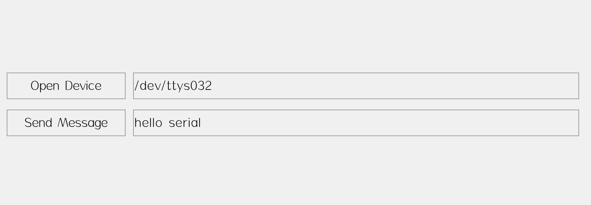

# 使用 serial\_widget 简化串口编程

把串口做成一个控件并不是一个新鲜的东西，记得在 Visual Basic 里有个通信组件，就是用来简化串口编程的。最近 AWTK 也提供了这样一个控件 serial\_widget，当串口数据到来时，它触发 EVT\_DATA 事件，在该事件中你可以读取数据，并更新界面或者回应对方。本文介绍一下它的使用方法：

## 1. 基本功能

我们编写一个简单的应用程序，它有两个功能：

* 把收到的数据显示出来。

* 把界面输入的数据发送给对方。

## 2. UI 界面描述文件



```xml
<window>
  <button name="open" text="Open Device" x="10" y="100" w="160" h="36" />
  <edit name="device" x="180" y="100" w="-200" h="36" text="/dev/ttys032" />

  <button name="send" text="Send Message" x="10" y="150" w="160" h="36" />
  <edit name="send_msg" x="180" y="150" w="-200" h="36" text="hello serial" />

  <label name="recv_msg" x="c" y="b:100" w="90%" h="100" />

  <serial name="serial" />
</window>
```

## 3. 接收数据

* 先注册数据事件的处理函数

```c
widget_child_on(win, "serial", EVT_DATA, on_data, win);
```

* 在处理函数中读取数据并显示到界面上

```c
static ret_t on_data(void* ctx, event_t* e) {
  char text[128] = {0};
  widget_t* win = WIDGET(ctx);
  serial_widget_t* serial = SERIAL_WIDGET(e->target);
  widget_t* label = widget_lookup(win, "recv_msg", TRUE);

  int32_t len = tk_istream_read(serial->istream, text, sizeof(text)-1);
  if(len > 0) {
    text[len] = '\0';
    widget_set_text_utf8(label, text);
  }

  return RET_OK;
}
```

## 4. 发送数据

从界面读取数据，并发送到串口

```c
static ret_t on_send(void* ctx, event_t* e) {
  char text[128] = {0};
  widget_t* win = WIDGET(ctx);
  serial_widget_t* serial = SERIAL_WIDGET(widget_lookup(win, "serial", TRUE));
  widget_t* edit = widget_lookup(win, "send_msg", TRUE);
  widget_get_text_utf8(edit, text, sizeof(text)-1);

  tk_ostream_write_len(serial->ostream, text, strlen(text), 3000);

  return RET_OK;
}
```

完整代码请参考 [serial](https://github.com/zlgopen/awtk-c-demos/blob/master/demos/serial.c) 可以下载 awtk-c-demos 编译运行。

```
./bin/demo_serial
```

## 5. 测试

> 下面操作是在 Linux/MacOS 上测试的，Windows 下需要安装虚拟串口软件，具体做法有些不同，请自行调整。

* 使用 socat 创建虚拟串口

```
socat -d -d pty,raw,echo=0 pty,raw,echo=0
```

该命令会生成两个设备文件，对应串口的两端（每次生成的设备名可能不同）。

```c
2022/07/08 16:32:33 socat[1879] N PTY is /dev/ttys032
2022/07/08 16:32:33 socat[1879] N PTY is /dev/ttys033
2022/07/08 16:32:33 socat[1879] N starting data transfer loop with FDs [5,5] and [7,7]
```

* 在 AWTK 这端我们使用设备 /dev/ttys032

* 在另外一端读取数据

打开一个新的终端，并运行下面的命令（有数据时自动显示出来）：

```
cat /dev/ttys033
```

* 在另外一端发送数据

打开一个新的终端，并运行下面的命令（发送当前时间字符串）：

```
date >/dev/ttys033
```

## 6. 使用 fscript 进行串口编程

也可以使用 fscript 进行串口编程（配合 AWBlock 就简单了）。AWTK 里提供一个与前面功能相同的例子，总体来看要简洁不少。

```xml
<window>
  <button text="打开设备" x="16" y="15" w="76" h="34" >
    <property name="on:click">
      var device = widget_get('device', 'text')
      widget_set('serial','device', device)
    </property>
  </button>

  <edit name="device" x="119" y="13" w="178" h="38" text="/dev/ttys028" />
  <label name="recv" x="5" y="123" w="303" h="101" />
  <edit name="send" text="hello serial" x="5" y="273" w="200" h="34" />

  <button text="button" tr_text="send" x="220" y="274" w="81" h="34" >
    <property name="on:click">
      var os = widget_get('serial','ostream')
      var msg = widget_get('send', 'text')
      ostream_write_string(os, msg)
    </property>
  </button>

  <serial name="serial">
    <property name="on:data">
      var is = widget_get('self','istream')
      var msg = istream_read_string(is, 100, 0)
      widget_set('recv', 'text', msg)
    </property>
  </serial>
</window>
```

在 AWTK 根目录下可以运行该例子，测试方法与前面相同。

```
./bin/preview_ui design/default/ui/serial.xml
```

## 7. 移植

目前串口只实现了Windows, Linux, MacOS, Android 和 AWorks 等平台，其它平台需要自己移植。

请参考AWorks平台的移植：src/platforms/aworkslp/serial_helper.c

## 8. 注意

* windows 平台需要调用 tk\_socket\_init 初始化 socket。

