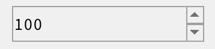
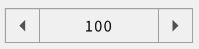
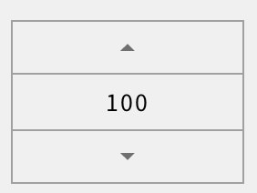

# spin_box 的几种形态

spin_box 是一个特殊的 edit，主要用于数值编辑。它自带两个按钮，点击它们可以增加/减少数值，增量可以用 step 来设置。

在 AWTK 中，spin\_box 有三种形态。

## 1. 传统形态



### 1.1 特点

两个按钮均在右侧，按钮比较小，相距很近，只要移动很小距离，即可在两个按钮之间切换，适合鼠标这种比较精确的输入设备。

### 1.2 按钮的 style：

* 增加 (inc) 按钮的 style 由 spinbox_up 决定。
* 减小 (dec) 按钮的 style 由 spinbox_down 决定。

### 1.3 示例：

* UI

```xml
<spin_box x="5%" y="10" w="50%" h="30" text="100"/>
```

* style

```xml
  <style name="spinbox_down" border_color="#a0a0a0">
    <normal     bg_color="#f0f0f0" icon="arrow_down_n"/>
    <pressed    bg_color="#c0c0c0" icon="arrow_down_p"/>
    <over       bg_color="#e0e0e0" icon="arrow_down_o"/>
  </style>

  <style name="spinbox_up" border_color="#a0a0a0">
    <normal     bg_color="#f0f0f0" icon="arrow_up_n"/>
    <pressed    bg_color="#c0c0c0" icon="arrow_up_p"/>
    <over       bg_color="#e0e0e0" icon="arrow_up_o"/>
  </style>
```

## 2. 按钮在左右两侧



### 2.1 特点

按钮在编辑器左右两侧，按钮比较大，不容易发生误操作。适合电容屏这种不太精确的输入设备。

### 2.2 按钮的 style：

* 增加 (inc) 按钮的 style 由 spinbox_right 决定。
* 减小 (dec) 按钮的 style 由 spinbox_left 决定。

### 2.3 使用方法

* 需要设置 easy\_touch\_mode="true" 
* 控件的 style 中设置文本居中。

### 2.4 示例：

* UI

```xml
<spin_box x="5%" y="100" w="50%" h="30" text="100" easy_touch_mode="true" style="center"/>
```

* style

```xml
  <style name="spinbox_left" border_color="#a0a0a0">
    <normal     bg_color="#f0f0f0" icon="arrow_left_n"/>
    <pressed    bg_color="#c0c0c0" icon="arrow_left_p"/>
    <over       bg_color="#e0e0e0" icon="arrow_left_o"/>
  </style>
  
  <style name="spinbox_right" border_color="#a0a0a0">
    <normal     bg_color="#f0f0f0" icon="arrow_right_n"/>
    <pressed    bg_color="#c0c0c0" icon="arrow_right_p"/>
    <over       bg_color="#e0e0e0" icon="arrow_right_o"/>
  </style>
```

## 3. 按钮在上下两端



### 3.1 特点

按钮在编辑器上下两端，按钮比较大，不容易发生误操作。适合电容屏这种不太精确的输入设备。

### 3.2 按钮的 style：

* 增加 (inc) 按钮的 style 由 spinbox_top 决定。
* 减小 (dec) 按钮的 style 由 spinbox_bottom 决定。

### 3.3 使用方法：

* 需要设置 easy\_touch\_mode="true" 
* 控件的 style 中设置文本居中。
* 并保证控件的高度大于字体大小的 3 倍

### 3.4 示例：

* UI

```xml
<spin_box x="5%" y="200" w="40%" h="90" text="100" easy_touch_mode="true" style="center"/>
```

* style

```xml
  <style name="spinbox_bottom" border_color="#a0a0a0">
    <normal     bg_color="#f0f0f0" icon="arrow_down_n"/>
    <pressed    bg_color="#c0c0c0" icon="arrow_down_p"/>
    <over       bg_color="#e0e0e0" icon="arrow_down_o"/>
  </style>

  <style name="spinbox_top" border_color="#a0a0a0">
    <normal     bg_color="#f0f0f0" icon="arrow_up_n"/>
    <pressed    bg_color="#c0c0c0" icon="arrow_up_p"/>
    <over       bg_color="#e0e0e0" icon="arrow_up_o"/>
  </style>
```

> 在 AWTK 中，spin\_box 完全可以用 edit + button 来实现，只是直接使用 spin\_box 要简单一些。使用时可以根据自己的实际情况进行选择。