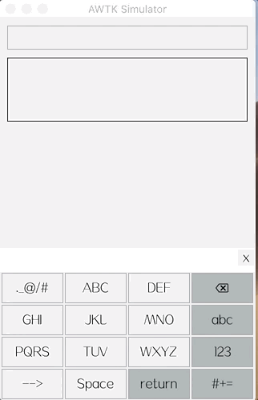

# T9 输入法笔记（触屏版）

## 1. T9 输入法的中文字典数据

网上可以找到 T9 输入法的中文字典数据，但是通常有两个问题：

* 采用 GPL 协议，不太适合加入 AWTK。

* 只支持单个汉字的输入，不支持词组的输入。

经过考虑之后，决定自己生成 T9 输入法的中文字典数据。AWTK 使用了谷歌拼音输入法作为缺省的拼音输入法，谷歌拼音输入法的字典数据质量还是不错的，写一个工具把谷歌拼音输入法的字典数据转换为 T9 输入法的中文字典数据即可。

谷歌拼音输入法的字典数据原始格式为：

```
汉字 频率 简体/繁体标志 拼音
```

如：

```
中 243213.912993 0 zhong
```

转换工具要做的事情的是：

* 把拼音转换成对应的数字。比 zhong 对应的是 83553。

* 生成适合查询的格式。本来想复用谷歌拼音输入的引擎，但是没有成功，最后决定自己写程序来查询。

转换工具完整的代码请参考：awtk/tools/t9_gen/to_t9_zh.js

> 如果需要对字典进行裁剪，可以先编辑原始数据，然后重新生成数据。

## 2. T9 输入法的英文字典数据

要生成英文字典数据，获取一个英文单词列表，并且按照单词的使用频率进行排序。找 [github](https://github.com/first20hours/google-10000-english.git) 上找到了这样的数据。

同样需要写个小工具，把该数据转成生成适合查询的格式。

转换工具完整的代码请参考：awtk/tools/t9_gen/to_t9_en.js

> 该工具应该同样适用于其它西文语言。

## 3. 对键盘、输入法框架和编辑器进行改进

为了支持 T9 输入法，需要对键盘、输入法框架和编辑器进行改进。

> 随便提一下，SOLID 原则中的开闭原则通常只存在于理想（简单）情况下，一种切实可行的方法是，在早期设计时要考虑将来的扩展，但也无需过度设计，而是每次扩展时都对框架进行完善，让它更适应于将来的扩展。

### 3.1 支持语言切换

同样是在中文环境下，你可能需要输入中文，也可能需要输入英文。在中文键盘下输入中文，在英文键盘下输入英文。 在键盘切换时需要让输入法引擎知道当前的语言。

#### 3.1.1 键盘

如果需要切换语言，可以给键盘的页面设置一个 lang 属性，用于标识改键盘的语言，切换到该页面时，自动设置输入法引擎的语言。

如：

```xml
    <view name="chinese" lang="zh_cn" 
      x="0" y="0" w="100%" h="100%" children_layout="default(r=4,c=4,s=2,m=2)">
        <button repeat="300" name="，" text="，"/>
        <button repeat="300" name="key:1" text="ABC"/>
        <button repeat="300" name="key:2" text="DEF"/>
        <button repeat="300" name="key:backspace" style="highlight">
          <image draw_type="icon" image="backspace" x="center" y="middle" w="100%" h="100%"/>
        </button>
        <button repeat="300" name="key:3" text="GHI"/>
        <button repeat="300" name="key:4" text="JKL"/>
        <button repeat="300" name="key:5" text="MNO"/>
        <button name="page:lower" style="highlight" text="abc"/>

        <button repeat="300" name="key:6" text="PQRS"/>
        <button repeat="300" name="key:7" text="TUV"/>
        <button repeat="300" name="key:8" text="WXYZ"/>
        <button name="page:symbols" style="highlight" text="#+="/>
        <button repeat="300" name="opt:。？！" text="。？！"/>
        <button repeat="300" name="space" text="Space"/>
        <button name="action" style="highlight" text="Return"/>
        <button name="page:number" style="highlight" text="123"/>
    </view>
```

在切换键盘时，如果存在 lang 属性，将其设置到输入法。

```c
    value_t v;
    widget_t* active = widget_get_child(iter, widget_get_value(iter));

    if (widget_get_prop(active, WIDGET_PROP_IM_LANG, &v) == RET_OK) {
      input_method_set_lang(input_method(), value_str(&v));
    }
```

#### 3.1.2 输入法提供设置语言的函数

```c
/**
 * @method input_method_set_lang
 * 设置语言。
 *
 * > 有的输入法，同时支持输入多种语言。
 * > 比如 T9，可以同时支持中文和英文输入，配合软键盘随时切换输入的语言。
 *
 * @annotation ["scriptable"]
 * @param {input_method_t*} im 输入法对象。
 * @param {const char*} lang 语言。
 *
 * @return {ret_t} 返回 RET_OK 表示成功，否则表示失败。
 */
ret_t input_method_set_lang(input_method_t* im, const char* lang);
```

#### 3.1.3 输入法引擎提供设置语言的函数

```c
/**
 * @engine input_engine_set_lang
 * 设置语言。
 * @annotation ["scriptable"]
 * @param {input_engine_t*} engine 输入法引擎对象。
 * @param {const char*} lang 语言。
 *
 * @return {ret_t} 返回 RET_OK 表示成功，否则表示失败。
 */
ret_t input_engine_set_lang(input_engine_t* engine, const char* lang);

```

### 3.2 支持预编辑状态 (preedit)

预编辑状态是在文本真正提交到编辑器之前的状态，在预编辑状态下输入的文本，可以被后面的输入覆盖。比如软键盘上，一个按键有 ABC 三个字符，按一下输入 A，再按一下输入 B，继续按钮输入 C，在指定时间内没有按，则提交当前的字符到编辑器。



#### 3.2.1 软键盘

键盘的按钮名称以"opt:"开头的按钮，表示这个按钮需要预编辑处理。为了支持预编辑输入，软键盘在按钮事件处理函数中，要做下列处理：

* 当前不在预编辑状态时，则进入预编辑状态，并启动定时器，把当前字符的序数设置为 0，并提交字符到编辑器。

* 当前在预编辑状态，更新定时器，把字符的序数设置为下一个，并提交字符到编辑器。

* 定时器超时或点击其它按钮，退出预编辑。

> 详情参考函数：keyboard\_on\_button\_click

#### 3.2.2 输入法

输入法需要提供几个函数用于中转消息：

```c
/**
 * @method input_method_dispatch_preedit
 * 分发进入预编辑状态的事件。
 * @annotation ["scriptable"]
 * @param {input_method_t*} im 输入法对象。
 *
 * @return {ret_t} 返回 RET_OK 表示成功，否则表示失败。
 */
ret_t input_method_dispatch_preedit(input_method_t* im);

/**
 * @method input_method_dispatch_preedit_confirm
 * 分发确认预编辑状态的事件（提交预编辑内容，退出预编辑状态）。
 * @annotation ["scriptable"]
 * @param {input_method_t*} im 输入法对象。
 *
 * @return {ret_t} 返回 RET_OK 表示成功，否则表示失败。
 */
ret_t input_method_dispatch_preedit_confirm(input_method_t* im);

/**
 * @method input_method_dispatch_preedit_abort
 * 分发取消预编辑状态的事件（提交预编辑内容，退出预编辑状态）。
 * @annotation ["scriptable"]
 * @param {input_method_t*} im 输入法对象。
 *
 * @return {ret_t} 返回 RET_OK 表示成功，否则表示失败。
 */
ret_t input_method_dispatch_preedit_abort(input_method_t* im);

```

#### 3.2.3 编辑器

编辑器需要处理相关事件：

```c
    case EVT_IM_PREEDIT: {
      text_edit_preedit(edit->model);
      break;
    }
    case EVT_IM_PREEDIT_CONFIRM: {
      text_edit_preedit_confirm(edit->model);
      break;
    }
    case EVT_IM_PREEDIT_ABORT: {
      text_edit_preedit_abort(edit->model);
      break;
    }
```

>具体请参考：edit.c/mledit.c

## 4. T9 输入法引擎的实现

T9 输入法引擎的实现很简单，不到 300 行代码。查找算法为：先精确查找，如果找到，将其添加到候选字列表中，否则使用前缀查找，在满足前缀的候选字中，挑选词频最高的，放到候选字列表中。

> 详情参考：input_engine_t9.c/t9.c
