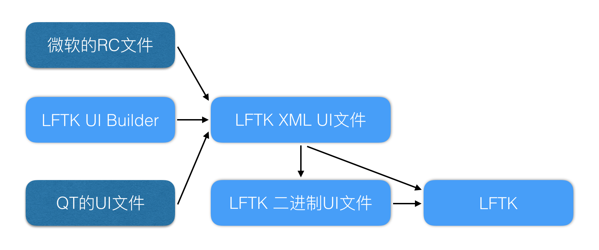

# AWTK 中的界面描述数据

AWTK 可以直接加载 XML 格式的和二进制格式的界面描述数据，从性能和资源开销的角度考虑，二进制格式是更好的选择，AWTK 提供了工具将 XML 格式转换成二进制格式的界面描述数据，也提供了将 QT 的 UI 文件转换成 AWTK XML 格式的界面描述文件的工具，其工作流程如下：



> AWStudio 在开发之中...

## 一、界面描述数据的使用方法

### 1. 创建 XML 格式的界面描述文件

AWTK XML 界面描述数据非常紧凑和直观。标签的名称对应控件的类型，标签的属性对应控件的属性。常见的属性有：

* x x 坐标
* y y 坐标
* w 宽度
* h 高度
* text 文本
* value 值
* name 是控件的名称，创建完成之后可以用 widget\_look\_up 函数找到指定名称的控件。

> 控件的属性请参考控件的文档。

> 用户可以定义自己的需要的属性。

> x/y/w/h 可以使用 [AWTK 的 layout 参数](layout.md)。

示例：

```xml
<window name="main" x="0" y="0" w="320" h="480">
  <button name="inc" x="10" y="5" w="40%" h="30" text="Inc"/>
  <button name="dec" x="right:10" y="5" w="40%" h="30" text="Dec"/>
  <image name="img" x="10" y="230" w="100" h="100"/>
  <label name="" x="10" y="40" w="80" h="30" text="Left"/>
  <label name="" x="100" y="40" w="80" h="30" text="Center"/>
  <label name="" x="200" y="40" w="80" h="30" text="Right"/>
  <progress_bar name="bar1" x="10" y="80" w="168" h="30" value="40"/>
  <progress_bar name="bar2" x="260" y="80" w="30" h="118" value="20" vertical="true"/>
  <check_button name="c1" x="10" y="150" w="80" h="30" text="Book"/>
  <check_button name="c2" x="100" y="150" w="80" h="30" text="Food"/>
  <radio_button name="r1" x="10" y="200" w="80" h="30" text="Book"/>
  <radio_button name="r2" x="100" y="200" w="80" h="30" text="Food"/>
  <radio_button name="r3" x="190" y="200" w="80" h="30" text="Pencil" value="true"/>
  <button name="dialog" x="10" y="260" w="40%" h="30" text="Dialog"/>
  <button name="dialog2" x="right:10" y="260" w="40%" h="30" text="Dialog2"/>
</window>
```

有时 text 或其它属性中出现了<>"等特殊字符，需要转义成 entity 才符合 XML 规范，此时使用起来比较麻烦。可以把它放到 property 标签中，并用 CDATA 把它括起来。如：

示例:

```xml
  <rich_text x="0" y="0" w="100%" h="60">
    <property name="text">
      <![CDATA[<image name="bricks"/><font align_v="middle">hello awtk!</font><font color="red" size="32">ZLG</font>]]>
    </property>
  </rich_text>
```
> property 标签必须放在第一个控件之前。

> 除了x、y、w和h的任何属性都可以放到 property TAG 中，请根据实际情况决定。

### 2. 预览 XML 格式的界面描述文件

XML UI 文件写好后，可以用预览工具预览。如：

```
./bin/preview_ui demos/assets/raw/ui/main.xml
```

### 3. 转换成二进制格式的界面描述文件

对 XML 预览的效果满意之后，把它转换成二进制的格式：

```
 ./bin/xml_to_ui window1.xml window1.data
```

为了方便在没有文件系统的嵌入式系统中使用，直接生成常量数据，和程序一起编译。如：

```
  1 const unsigned char ui_window1[] = {
  2 0x07,0x00,0x00,0x00,0xdb,0x02,0x00,0x00,0x77,0x69,0x6e,0x64,0x6f,0x77,0x31,0x00,0x64,0x61,0x74,0x61,
  3 0x00,0x00,0x00,0x00,0x12,0x12,0x22,0x11,0x01,0x00,0x02,0x00,0x00,0x00,0x00,0x00,0x00,0x00,0x00,0x00,
  4 0x00,0x00,0x00,0x00,0x40,0x01,0x00,0x00,0xe0,0x01,0x00,0x00,0x6e,0x61,0x6d,0x65,0x00,0x6d,0x61,0x69,
  5 0x6e,0x00,0x00,0x01,0x00,0x0a,0x00,0x00,0x00,0x01,0x00,0x0a,0x00,0x00,0x00,0x05,0x00,0x00,0x00,0x28,
  6 0x00,0x00,0x00,0x1e,0x00,0x00,0x00,0x6e,0x61,0x6d,0x65,0x00,0x69,0x6e,0x63,0x00,0x74,0x65,0x78,0x74,
  7 0x00,0x49,0x6e,0x63,0x00,0x00,0x00,0x01,0x00,0x0a,0x00,0x03,0x00,0x01,0x00,0x0a,0x00,0x00,0x00,0x05,
  8 0x00,0x00,0x00,0x28,0x00,0x00,0x00,0x1e,0x00,0x00,0x00,0x6e,0x61,0x6d,0x65,0x00,0x64,0x65,0x63,0x00,
  9 0x74,0x65,0x78,0x74,0x00,0x44,0x65,0x63,0x00,0x00,0x00,0x01,0x00,0x0b,0x00,0x00,0x00,0x00,0x00,0x0a,
 10 0x00,0x00,0x00,0xe6,0x00,0x00,0x00,0x64,0x00,0x00,0x00,0x64,0x00,0x00,0x00,0x6e,0x61,0x6d,0x65,0x00,
 11 0x69,0x6d,0x67,0x00,0x00,0x00,0x01,0x00,0x09,0x00,0x00,0x00,0x00,0x00,0x0a,0x00,0x00,0x00,0x28,0x00,
 12 0x00,0x00,0x50,0x00,0x00,0x00,0x1e,0x00,0x00,0x00,0x6e,0x61,0x6d,0x65,0x00,0x00,0x74,0x65,0x78,0x74,
 13 0x00,0x4c,0x65,0x66,0x74,0x00,0x00,0x00,0x01,0x00,0x09,0x00,0x00,0x00,0x00,0x00,0x64,0x00,0x00,0x00,
 14 0x28,0x00,0x00,0x00,0x50,0x00,0x00,0x00,0x1e,0x00,0x00,0x00,0x6e,0x61,0x6d,0x65,0x00,0x00,0x74,0x65,
 15 0x78,0x74,0x00,0x43,0x65,0x6e,0x74,0x65,0x72,0x00,0x00,0x00,0x01,0x00,0x09,0x00,0x00,0x00,0x00,0x00,
 16 0xc8,0x00,0x00,0x00,0x28,0x00,0x00,0x00,0x50,0x00,0x00,0x00,0x1e,0x00,0x00,0x00,0x6e,0x61,0x6d,0x65,
 17 0x00,0x00,0x74,0x65,0x78,0x74,0x00,0x52,0x69,0x67,0x68,0x74,0x00,0x00,0x00,0x01,0x00,0x0d,0x00,0x00,
 18 0x00,0x00,0x00,0x0a,0x00,0x00,0x00,0x50,0x00,0x00,0x00,0xa8,0x00,0x00,0x00,0x1e,0x00,0x00,0x00,0x6e,
 19 0x61,0x6d,0x65,0x00,0x62,0x61,0x72,0x31,0x00,0x76,0x61,0x6c,0x75,0x65,0x00,0x34,0x30,0x00,0x00,0x00,
 20 0x01,0x00,0x0d,0x00,0x00,0x00,0x00,0x00,0x04,0x01,0x00,0x00,0x50,0x00,0x00,0x00,0x1e,0x00,0x00,0x00,
 21 0x76,0x00,0x00,0x00,0x6e,0x61,0x6d,0x65,0x00,0x62,0x61,0x72,0x32,0x00,0x76,0x61,0x6c,0x75,0x65,0x00,
 22 0x32,0x30,0x00,0x76,0x65,0x72,0x74,0x69,0x63,0x61,0x6c,0x00,0x74,0x72,0x75,0x65,0x00,0x00,0x00,0x01,
 23 0x00,0x0f,0x00,0x00,0x00,0x00,0x00,0x0a,0x00,0x00,0x00,0x96,0x00,0x00,0x00,0x50,0x00,0x00,0x00,0x1e,
 24 0x00,0x00,0x00,0x6e,0x61,0x6d,0x65,0x00,0x63,0x31,0x00,0x74,0x65,0x78,0x74,0x00,0x42,0x6f,0x6f,0x6b,
 25 0x00,0x00,0x00,0x01,0x00,0x0f,0x00,0x00,0x00,0x00,0x00,0x64,0x00,0x00,0x00,0x96,0x00,0x00,0x00,0x50,
 26 0x00,0x00,0x00,0x1e,0x00,0x00,0x00,0x6e,0x61,0x6d,0x65,0x00,0x63,0x32,0x00,0x74,0x65,0x78,0x74,0x00,
 27 0x46,0x6f,0x6f,0x64,0x00,0x00,0x00,0x01,0x00,0x10,0x00,0x00,0x00,0x00,0x00,0x0a,0x00,0x00,0x00,0xc8,
 28 0x00,0x00,0x00,0x50,0x00,0x00,0x00,0x1e,0x00,0x00,0x00,0x6e,0x61,0x6d,0x65,0x00,0x72,0x31,0x00,0x74,
 29 0x65,0x78,0x74,0x00,0x42,0x6f,0x6f,0x6b,0x00,0x00,0x00,0x01,0x00,0x10,0x00,0x00,0x00,0x00,0x00,0x64,
 30 0x00,0x00,0x00,0xc8,0x00,0x00,0x00,0x50,0x00,0x00,0x00,0x1e,0x00,0x00,0x00,0x6e,0x61,0x6d,0x65,0x00,
 31 0x72,0x32,0x00,0x74,0x65,0x78,0x74,0x00,0x46,0x6f,0x6f,0x64,0x00,0x00,0x00,0x01,0x00,0x10,0x00,0x00,
 32 0x00,0x00,0x00,0xbe,0x00,0x00,0x00,0xc8,0x00,0x00,0x00,0x50,0x00,0x00,0x00,0x1e,0x00,0x00,0x00,0x6e,
 33 0x61,0x6d,0x65,0x00,0x72,0x33,0x00,0x74,0x65,0x78,0x74,0x00,0x50,0x65,0x6e,0x63,0x69,0x6c,0x00,0x76,
 34 0x61,0x6c,0x75,0x65,0x00,0x74,0x72,0x75,0x65,0x00,0x00,0x00,0x01,0x00,0x0a,0x00,0x00,0x00,0x01,0x00,
 35 0x0a,0x00,0x00,0x00,0x04,0x01,0x00,0x00,0x28,0x00,0x00,0x00,0x1e,0x00,0x00,0x00,0x6e,0x61,0x6d,0x65,
 36 0x00,0x64,0x69,0x61,0x6c,0x6f,0x67,0x00,0x74,0x65,0x78,0x74,0x00,0x44,0x69,0x61,0x6c,0x6f,0x67,0x00,
 37 0x00,0x00,0x01,0x00,0x0a,0x00,0x03,0x00,0x01,0x00,0x0a,0x00,0x00,0x00,0x04,0x01,0x00,0x00,0x28,0x00,
 38 0x00,0x00,0x1e,0x00,0x00,0x00,0x6e,0x61,0x6d,0x65,0x00,0x64,0x69,0x61,0x6c,0x6f,0x67,0x32,0x00,0x74,
 39 0x65,0x78,0x74,0x00,0x44,0x69,0x61,0x6c,0x6f,0x67,0x32,0x00,0x00,0x00,0x00,0x00,0x00,0x00,0x00,};
```

### 4. 使用二进制格式的界面描述文件

在程序中引用，并放入资源管理器中：

```
#include "res/ui/window1.data"
...

assets_manager_add((const asset_info_t*)ui_window1);
```

在需要打开该窗口时，调用 window\_open 函数（对话框用 dialog\_open):

```
  widget_t* win = window_open(name);

  widget_child_on(win, "ok", EVT_CLICK, on_ok, win);
  widget_child_on(win, "cancel", EVT_CLICK, on_cancel, win);
```

## 二、将 Qt 的 UI 文件转成 AWTK UI XML 文件（目前不成熟）。

转换工具在 bin/qt\_to\_xml 目录下，使用方法：

```
Usage: ./bin/qt_to_xml in_filename out_filename
   Ex: ./bin/qt_to_xml demo1.ui demo1.xml
```
