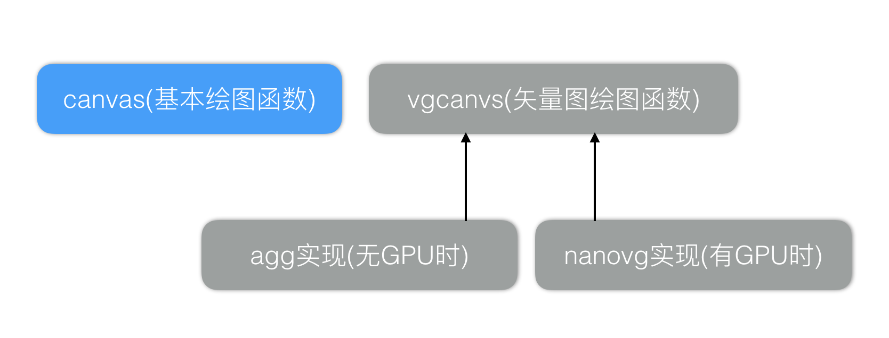

# AWTK中的矢量图绘图函数

### 一、工作模式

强大的Vector graphics library对GUI来说至关重要，一些酷炫的效果更是离不开Vector graphics library的支持。最有名的Vector graphics library要数下面这些了：

* [GDI+](https://msdn.microsoft.com/en-us/library/ms533798(v=VS.85).aspx)
* [Quartz 2D](https://developer.apple.com/library/content/documentation/GraphicsImaging/Conceptual/drawingwithquartz2d/dq_overview/dq_overview.html)
* [skia](https://skia.org/)
* [cairo](https://www.cairographics.org/)
* [nanovg](https://github.com/memononen/nanovg)
* [agg](http://www.antigrain.com/)

其中最后4个是开源的，skia和cairo很强但也很大，不太适合嵌入式环境。nanovg是最简洁最优雅的，可惜它只支持OpenGL。agg是用纯软件实现的，速度相对来说也很快，虽然使用起来有点复杂，但也不失为一个好的选择。经过一番考虑之后，AWTK的canvas根据硬件环境分为三个层次：

* 简约模式。支持基本的绘图函数，但不支持Vector graphics绘图函数，能实现GUI常见功能。适用于低端的硬件环境，如CPU主频小于100M，RAM小于1M的情况。

* 正常模式。支持最基本的绘图函数，和软件实现的Vector graphics绘图函数，由于软件实现的Vector graphics绘图函数性能不高，所以只有在必要的情况下才使用它们。此时采用agg作为Vector graphics library。

* GPU模式。如果硬件支持OpenGL，则使用OpenGL实现的Vector graphics绘图函数，并用它们包装成基本的绘图函数。此时采用nanovg作为Vector graphics library。

> 注意：agg使用GPL协议开源，如果在商业软件中使用，需要作者协商一下。



### 二、接口函数

vgcanvas的接口如何定义呢，nanovg和agg的接口差异极大，必须为AWTK上层提供统一的接口。AWTK采用了[HTML5 canvas](http://www.w3school.com.cn/tags/html_ref_canvas.asp)类似的接口，这套接口非常好用，但由于底层的agg和nanovg的限制，在有GPU和无GPU时，效果可能不太一样，甚至不兼容，所以在使用时尽量保守一点:)

```

ret_t vgcanvas_begin_path(vgcanvas_t* vg);
ret_t vgcanvas_move_to(vgcanvas_t* vg, float_t x, float_t y); 
ret_t vgcanvas_line_to(vgcanvas_t* vg, float_t x, float_t y); 
ret_t vgcanvas_quadratic_curve_to(vgcanvas_t* vg, float_t cpx, float_t cpy, float_t x, float_t y); 
ret_t vgcanvas_bezier_curve_to(vgcanvas_t* vg, float_t cp1x, float_t cp1y, float_t cp2x, float_t cp2y,
                               float_t x, float_t y); 
ret_t vgcanvas_arc_to(vgcanvas_t* vg, float_t x1, float_t y1, float_t x2, float_t y2, float_t r); 
ret_t vgcanvas_arc(vgcanvas_t* vg, float_t x, float_t y, float_t r, float_t start_angle,
                   float_t end_angle, bool_t ccw);
bool_t vgcanvas_is_point_in_path(vgcanvas_t* vg, float_t x, float_t y); 
ret_t vgcanvas_rect(vgcanvas_t* vg, float_t x, float_t y, float_t w, float_t h); 
ret_t vgcanvas_round_rect(vgcanvas_t* vg, float_t x, float_t y, float_t w, float_t h, float_t r); 
ret_t vgcanvas_ellipse(vgcanvas_t* vg, float_t x, float_t y, float_t rx, float_t ry);
ret_t vgcanvas_close_path(vgcanvas_t* vg);

...

```

### 三、使用示例

```
  vgcanvas_t* vg = lcd_get_vgcanvas(c->lcd);

  vgcanvas_set_line_width(vg, 2); 
  vgcanvas_set_fill_color(vg, color_init(0xff, 0xff, 0, 0xff));
  vgcanvas_set_stroke_color(vg, color_init(0, 0xff, 0, 0xff));
  vgcanvas_clear_rect(vg, 0, 0, vg->w, vg->h, color_init(0xf0, 0xf0, 0xf0, 0xff));
  
  vgcanvas_round_rect(vg, 10, 10, 100, 20, 5); 
  vgcanvas_stroke(vg);

  vgcanvas_rect(vg, 128, 10, 100, 20);
  vgcanvas_fill(vg);
```

