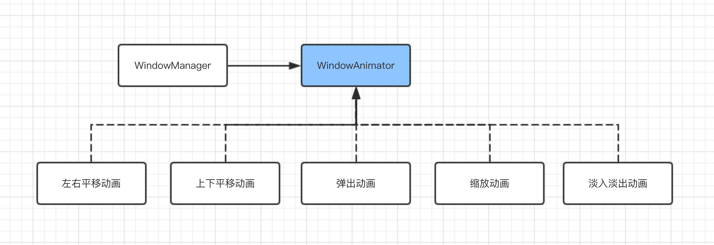

# AWTK 中的窗口动画

窗口动画是现代 GUI 最基本的功能之一，在窗口打开或关闭时，引入一个过渡动画，让用户感觉这个过程是流畅的。窗口动画的基本原理很简单：在打开或关闭窗口时，把前后两个窗口预先绘制到两张内存图片上，按照指定规则显示两张图片，形成动画效果。

## 一、介绍

窗口本身只需指定期望的动画类型，由窗口管理器负责在适当的时候（如打开和关闭窗口时），创建窗口动画并让窗口动画绘制到屏幕上。在窗口动画期间，窗口管理器会禁止窗口本身的绘制，并忽略所有输入事件。目前支持的动画有：

普通窗口动画：

* htranslate: 左右平移动画（速度最快，嵌入式平台推荐使用）。
* vtranslate: 上下平移动画。
* slide\_up: 向上弹出。
* slide\_down: 向下弹出。
* slide\_left: 向左弹出。
* slide\_right: 向右弹出。 

对话框动画：

* popup: 向上弹出（速度最快，嵌入式平台推荐使用）。
* popdown: 向下弹出。
* fade: 淡入淡出动画。
* center\_scale: 缩放动画（没有硬件时加速慎用）。

>以前的 bottom\_to\_top 相当于 popup，仍然可以使用，但建议用 popup 代替。
>
>以前的 top\_to\_bottom 相当于 popdown，仍然可以使用，但建议用 popdown 代替。

> 对话框的动画可与 [对话框的 highlight 属性](dialog_highlight.md) 一起使用。



窗口动画有三种实现方式：

* 在系统支持 OpenGL 时，使用 vgcanvas 进行绘制，因为使用了浮点数，整个动画最为平滑。

* 在系统支持 FrameBuffer，使用 lcd 绘图函数实现动画。

* 在低端系统上，不启用动画。

## 二、使用方法

给窗口或对话框指定动画效果，只需设置窗口或对话框的 anim\_hint 属性即可：

```
  <window name="main" anim_hint="vtranslate">
...
  </window>
```

> anim\_hint 的可选值，请参考 [window\_animator.h](https://github.com/zlgopen/awtk/blob/master/src/base/window_animator.h) 中的定义。

## 三、动画参数

可以为动画指定参数，其格式为 [类似函数调用的参数格式](func_call_params_format.md)。

1. 所有动画都支持下面的参数：

* duration 动画持续时间（毫秒）
* easing [插值算法名称](easing.md)

如：

```
anim_hint="center_scale(duration=300)"
```

2.slide\_up、slide\_down、slide\_left 和 slide\_right 动画特有参数：

> alpha 值用于在背景上画一层透明的颜色，这能够实现让背景变暗的效果。如果 start\_alpha 和 end\_alpha 不相同，则能实现动态变暗的效果，这有额外的运行开销，如果性能不佳，建议设置 alpha 即可。

* start_alpha 起始 alpha 值 (0-255)。
* end_alpha 结束 alpha 值 (0-255)。
* alpha 相当于将 start\_alpha 和 end\_alpha 设置为同一个值。

## 四、示例

demoui 演示了各种窗口动画：

```
./bin/demoui
```

## 五、自定义动画

开发者可以自定义动画，自定义的动画可以像内置动画一样，在 XML 文件中启用。

自定义动画非常简单，通常只需要几行代码即可。步骤如下：

1. 实现 window\_animator\_t 接口。如：

```
static const window_animator_vtable_t s_window_animator_popup_vt = { 
    .overlap = TRUE,
    .type = "popup",
    .desc = "popup",
    .size = sizeof(window_animator_t),
    .draw_prev_window = window_animator_overlap_default_draw_prev,
    .draw_curr_window = window_animator_to_top_draw_curr};

window_animator_t* window_animator_popup_create(bool_t open, object_t* args) {
  return window_animator_create(open, &s_window_animator_popup_vt);
}
```

2. 注册到 window\_animator 工厂。如：

```
  window_animator_factory_register(factory, WINDOW_ANIMATOR_POPUP,
                                   window_animator_popup_create);
```

> 完整示例请参考：https://github.com/zlgopen/awtk/tree/master/src/window_animators

## 其它

启用窗口动画时，默认情况下，需要对前后两个窗口进行截图，以获得更好的性能，但是需要两个 FB 大小的内存。如果内存不够（比如只有片内内存），可以选择关闭缓存，直接进行绘制。在 awtk_config.h 定义下面的宏即可：

```c
#define WITHOUT_WINDOW_ANIMATOR_CACHE 1
```