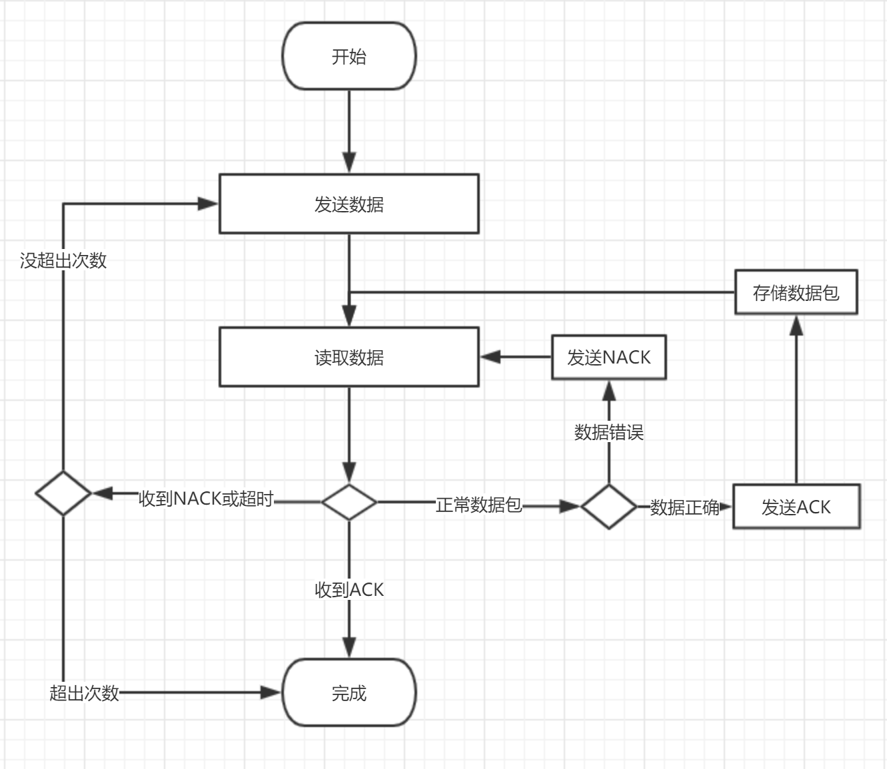
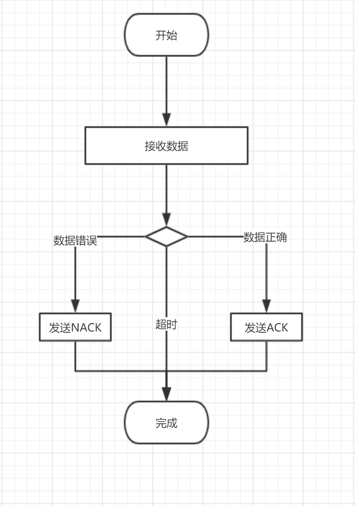
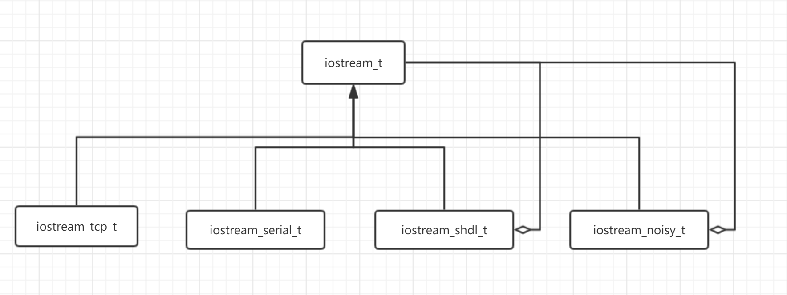

# SHDLC: 点对点可靠传输协议的设计与实现

SHDLC：Simplified HDLC（简化版 HDLC)。

> 本协议参考了 [HDLC](https://baike.baidu.com/item/HDLC) 协议和 [PPP](https://baike.baidu.com/item/PPP/6660214) 协议，并采用了类似的帧格式，保持了 HDLC 的简单，又吸取了 PPP 数据压缩的特性。

## 1. 范围

SHDLC 适用于 A 和 B 两个节点直接相连，不经过路由器等第三方节点的通信，底层保证数据流按顺序传递（比如串口）。

SHDLC 并不适合在 UDP 之上建立可靠的传输协议，要在 UDP 之上实现可靠传输协议，建议使用 [QUIC](https://www.chromium.org/quic) 协议。

## 2. 目标

在设计 SHDLC 协议时，我们主要考虑以下目标。

  * 支持错误检测。数据在传输过程中，无论时单个字节出错，还是整个数据包丢失，都可以检测到。

  * 支持错误恢复。数据在传输过程中，即使关键数据（如界定符）出错，也能够从错误状态恢复。

  * 支持失败重传。数据包丢失或者收到的数据包出错，通过重传机制确保数据传输成功。

  * 支持数据压缩。数据压缩不但可以提高传输效率，同时也变相提高了可靠性。

  * 实现简单。要实现一个可靠的传输协议，同时又要兼顾灵活性和传输效率，其实很是复杂的，如果搞得像 TCP 一样复杂，那就没有必要重新设计一个协议了。

## 3. 格式

### 3.1 数据包界定符

决定数据包是否结束，常见的方式有以下几种：

  * 固定长度的帧。实现简单但不具有通用性。
  * 指定数据长度。实现简单但很难实现错误恢复，长度本身一旦出错，后续数据就没法恢复了（除非内核支持）。
  * 数据包界定符。实现稍微复杂，但是易于实现错误恢复，即使界定符出错，丢掉当前帧即可。

综合考虑，我们采用**界定符**来决定数据包的结束，并采用 HDLC 协议同样的界定符 0x7E。

在采用界定符时，数据中就不能出现界定符，否则就会误判数据包的结束。所以如果数据包中出现了界定符，就需要对其进行转义处理。这里采用 HDLC 同样的处理方法，用 0x7D 作为转义字符。

数据包中出现的 0x7E 和 0x7D 都需要进行转义处理：

* 0x7E 转义为 0x7D 0x5E
* 0x7D 转义为 0x7D 0x5D

### 3.2 数据包检验

采用 16 位 CRC 检验和，多项式如下：

```
x**0 + x**5 + x**12 + x**16
```

实现代码请参考：https://github.com/lexus2k/tinyproto/blob/master/src/proto/crc/crc.h

> 和 HDLC 一样，对包头和原始数据进行校验，而不是对转义后的数据进行校验，这样在实现时要简单一些。

### 3.3 数据压缩

数据压缩是可选的。如数据包太短，压缩之后数据可能反而会变长。所以一般数据包的长度超出一定值（如 1024) 时才对数据进行压缩。所以在数据包头需要一个字段标识该数据包是否被压缩。

压缩算法采用 zlib 兼容的算法。

> 用 1 bit 来标识数据包是否压缩。

### 3.4 数据包的类型

目前定义以下几种有效的数据包类型：

* DATA 正常数据包。
* ACK  确认收到正确数据包
* NACK 确认收到错误数据包。 

> 用 3 bits 来标识包的类型，以备支持新的数据包类型（比如用于流控的数据包）。

### 3.5 数据包的序号

为了实现简单，目前采用同步数据传输：发送一个数据包，等待对方确认。如果超时或者收到 NACK 回应，需要重新传递，重传可能导致接收方收到重复的数据，所以需要用包的序号来区分是否是重复的数据包。

> 用 3 bits 来标识包的序号。同步传输有两个序号即可区分是否重复。使用 3 bits 的序号，以后可以支持一定程度的异步传输。

### 3.6 数据包的具体格式

#### 3.6.1 包头格式

包头占用一个字节，格式如下：

保留 (1 位） | 压缩 (1 位）       |     序号 (3 位）   |  类型 (3 位）
--------- | -------------- | ---------------|---------- 
保留      | 1: 压缩 0: 不压缩 |  递增           | 1:DATA 2:ACK 3:NACK

C 语言结构定义如下：

```
typedef enum { 
  SHDLC_INVALID = 0, 
  SHDLC_DATA, 
  SHDLC_ACK, 
  SHDLC_NACK 
} shdlc_frame_type_t;

#pragma pack(push, 1)
typedef union _shdlc_header_t {
  uint8_t data;
  struct {
    uint8_t type : 3;
    uint8_t seqno : 3;
    uint8_t compressed : 1;
    uint8_t reserve : 1;
  } s;
} shdlc_header_t;
#pragma pack(pop)
```

#### 3.6.2 正常数据包

界定符 (1B) | header(1B) |   数据（变长）    | FCS16(2B) | 界定符 (1B)
--------- | ----------- | ---------------|---------- | ---- | 
0x7E      | xx          |  xxxx          | xx xx     | 0x7E |

> Header的值、数据和FCS视具体情况而定。

#### 3.6.3 ACK 包

界定符 (1B) | header(1B) |  FCS16(2B) | 界定符 (1B)
--------- | ----------- | ---------- | ---- | 
0x7E      | 0x02        |  0x22 0x5F | 0x7E |

#### 3.6.4 NACK 包

界定符 (1B) | header(1B) |  FCS16(2B) | 界定符 (1B)
--------- | ----------- | ---------- | ---- | 
0x7E      | 0x03        |  0xAB 0x4E | 0x7E |

## 5. 收发流程

### 5.1 发送数据



> 在发送数据的同时，对方也可能发送数据，所以在发送数据后，读取响应数据包时，可能读到的是对方发送的数据包，此时应该把数据保存起来，以供后续读取。

### 5.2 接收数据



## 6. 实现与使用

用户并不需要自己实现协议的客户端，我们会提供 C 语言版本的 API（可以绑定到任何编程语言），下面简单介绍一下实现时的思路以及使用方法：

在 TKC (toolkit C library) 中，我们把传输协议抽象成 stream 对象，再通过 [装饰模式](https://design-patterns.readthedocs.io/zh_CN/latest/structural_patterns/decorator.html) 给 stream 对象加上新的功能，但是保持 stream 对象原来的接口。

比如，通过 iostream\_shdlc\_t 可以把不可靠的 iostream\_serial\_t 装饰成一个可靠的 stream 对象，也可以通过 iostream\_noisy\_t 把可靠的 iostream\_tcp\_t 装饰城成不可靠的 stream 对象（方便测试时进行故障注入）。



在实现时，iostream\_shdlc\_t 可以这样定义：

```
struct _tk_iostream_shdlc_t {
  tk_iostream_t iostream;
  /*xxx*/
  tk_iostream_t* real_iostream;
};

tk_iostream_t* tk_iostream_shdlc_create(tk_iostream_t* real_iostream);
```

> 在装饰模式的帮助下，传入一个不可靠的 stream 对象，返回一个可靠的 stream 对象。对于调用者没有影响。

下面的例子演示把串口 stream 对象包装成可靠的 stream 对象，然后使用 AW-Flow 客户端与 AW-Flow 设备通信的例子：

```
  aw_flow_client_packet_t resp;

  tk_iostream_t* iostream = tk_iostream_shdlc_create(tk_iostream_serial_create("COM1"));

  aw_flow_client_t* client = aw_flow_client_create(iostream);

  aw_flow_client_set_debug(client, TRUE);
  aw_flow_client_set_timeout(client, 60 * 1000);

  aw_flow_client_send_get_sys_info(client);
  aw_flow_client_read_resp(client, &resp);

  aw_flow_client_destroy(client);
  object_unref(OBJECT(iostream));
```
